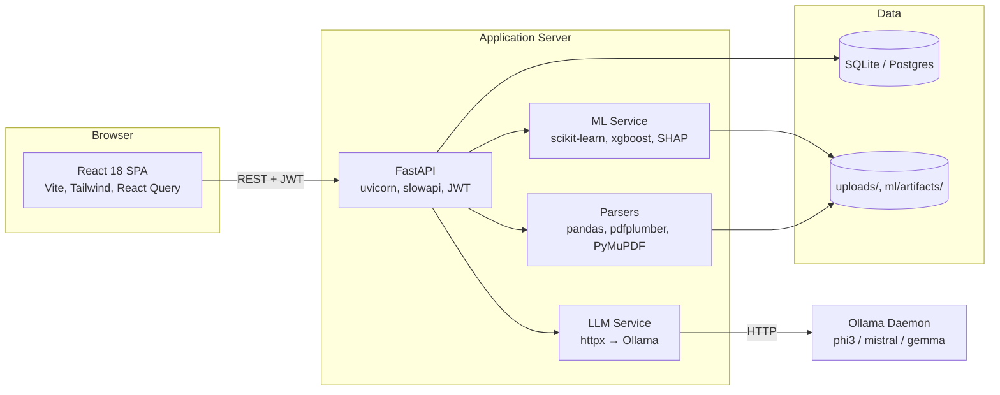
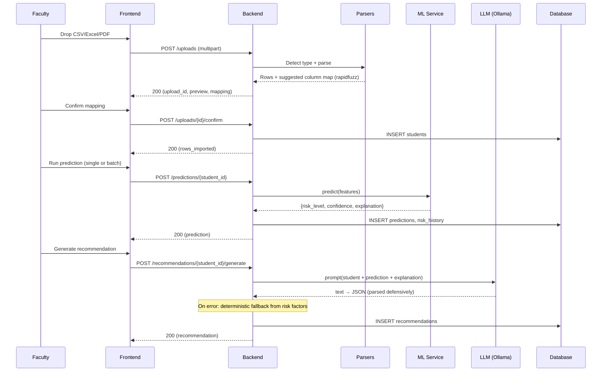

# Architecture

## 1. System Overview

The **AI Dropout Predictor** is a full-stack, on-premises platform that helps
academic institutions identify students at risk of dropping out, explain *why*
the model thinks so, and generate counseling recommendations — entirely
offline, with no cloud LLM calls.

```
   ┌──────────────┐   HTTPS    ┌────────────────────────┐   HTTP    ┌──────────┐
   │  React SPA   │◀──────────▶│   FastAPI (Python 3.11)│◀─────────▶│  Ollama  │
   │ (Vite + TS)  │   JWT       │  REST + JSON / SSE     │           │  (local) │
   └──────┬───────┘             │  ML + XAI + Auth       │           └──────────┘
          │                     └──────────┬─────────────┘
          │                                │
          │                       ┌────────▼────────┐
          │                       │ SQLAlchemy ORM  │
          │                       │ SQLite/Postgres │
          │                       └─────────────────┘
          │
          ▼
   Browser (LocalStorage JWT, Tailwind dark/light)
```

## 2. Container View (C4 Level 2)



## 3. Layered Backend

```
api/v1/endpoints  →  services  →  repositories  →  models / db
       │
       └─ schemas (Pydantic)  ←  validation, OpenAPI contract
```

* **api/v1/endpoints** — thin FastAPI routers, only HTTP concerns.
* **services** — business logic, orchestration, transactions.
* **repositories** — encapsulate query patterns; no SQL leaks above.
* **models** — SQLAlchemy 2.x declarative models.
* **schemas** — Pydantic v2 request/response DTOs.
* **ml** — feature engineering, training, prediction, explainability.
* **parsers** — file ingestion (CSV/Excel/PDF/DOCX) → normalized rows.

## 4. Data Flow: Upload → Prediction → Recommendation



## 5. Roles

| Role     | Capabilities                                                                     |
|----------|----------------------------------------------------------------------------------|
| admin    | Full CRUD on users + everything faculty can do; system settings; ML training.    |
| faculty  | Manage students in their department, run predictions, log counseling sessions.   |
| student  | View their own predictions, recommendations, and history (read-only profile).    |

Authorization is enforced via FastAPI `Depends` chains and a `RoleGate` helper.

## 6. Technology Choices Rationale

* **FastAPI** — async-friendly, Pydantic-native, auto-OpenAPI.
* **SQLite default** — zero-config for demos; switch to Postgres via `DATABASE_URL`.
* **scikit-learn + optional XGBoost** — broad model coverage without forcing GPU.
* **SHAP w/ permutation fallback** — explainability that degrades gracefully.
* **Ollama local LLM** — privacy, zero cloud cost, fully offline.
* **React 18 + Vite + Tailwind + React Query** — modern, fast DX, small bundle.

## 7. Non-Functional Targets

* **Cold-start prediction**: <300 ms once model is loaded.
* **Bulk import**: 5,000 rows in <10 s on commodity hardware.
* **Offline mode**: every page that doesn't need the LLM must work; LLM features fall back to deterministic templated text.
* **Security**: bcrypt + JWT + parameterized queries + extension/MIME validation + slowapi rate limits.

See [`database-schema.md`](./database-schema.md), [`api.md`](./api.md),
[`ml-pipeline.md`](./ml-pipeline.md), and the Mermaid diagrams under
[`diagrams/`](./diagrams/) for deeper detail.
