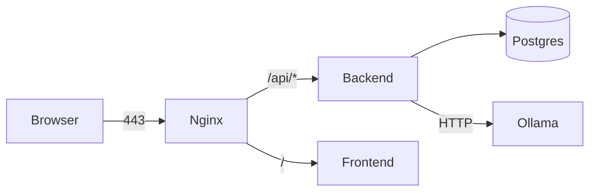

# Deployment

## Topologies

### A. Single-host Docker Compose (recommended for pilots)

* Use `docker compose --profile full up -d --build`.
* Front your Nginx (the bundled `frontend/nginx.conf`) with TLS via your
  preferred reverse proxy (Caddy, Traefik, Cloudflare Tunnel, ...).

### B. Kubernetes (sketch)

* `backend` Deployment (HPA on CPU)
* `frontend` Deployment + Service (or static files behind a CDN)
* `postgres` StatefulSet (or managed Postgres)
* `ollama` DaemonSet on GPU nodes (optional)
* PersistentVolumeClaims for `uploads/` and `ml/artifacts/`.

### C. Bare metal / on-prem

* `pip install -r backend/requirements.txt`
* `gunicorn -k uvicorn.workers.UvicornWorker app.main:app --workers 4 --bind 0.0.0.0:8000`
* `npm run build` in `frontend/` → serve `dist/` via Nginx/Apache.
* `systemd` units for `backend.service`, `ollama.service`.

## Production Hardening Checklist

- [ ] `SECRET_KEY` is a 64-byte random value (never the dev default).
- [ ] `APP_ENV=production`, `DEBUG=false`.
- [ ] `CORS_ORIGINS` is an explicit allowlist — no `*`.
- [ ] HTTPS terminated at the reverse proxy; HTTP redirects to HTTPS.
- [ ] Database backups (pg_dump nightly + WAL archiving).
- [ ] `ml/artifacts/` and `uploads/` mounted on persistent volumes.
- [ ] Rate limits hardened: `/auth/login` ≤ 5/min; `/chat` ≤ 30/min.
- [ ] Audit log retention policy defined (e.g. 365 days).
- [ ] Ollama bound to localhost only; never exposed publicly.
- [ ] CSP, HSTS, X-Frame-Options set in nginx.conf.
- [ ] Container images pinned by digest, not by tag.

## Scaling Notes

* The ML model is **process-local** (joblib + lazy load). For multi-worker
  deployments, ensure the artifact directory is shared (NFS / S3-fuse / volume).
* The LLM is the slowest call. Cache `recommendations` by
  `(student_id, prediction_id)` and only re-generate on demand.
* `predictions/batch` is `O(n)` over students — chunk it (e.g. 200/batch) to
  keep request latency reasonable; or move to a background worker.

## Backups

* SQLite: copy `backend/app.db` while the app is paused (or use `.backup`).
* Postgres: `pg_dump dropout > dropout-$(date +%F).sql`.
* `ml/artifacts/model.joblib` — version with the date in `model_meta.json`
  and copy to S3/Backblaze nightly.
