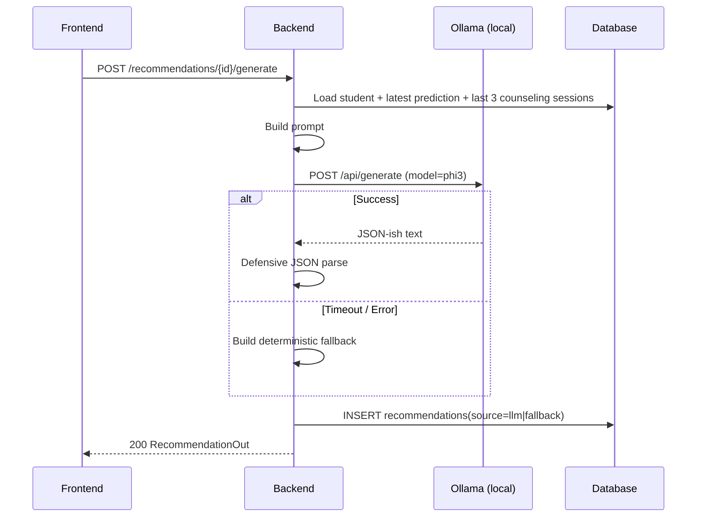

# LLM Integration

## 1. Hard Constraints

* **No cloud LLM calls. Ever.**
* The only egress allowed is to a **local Ollama daemon** at
  `OLLAMA_BASE_URL` (default `http://localhost:11434`).
* If Ollama is unreachable or returns an error, the system **must** stay
  functional via a deterministic fallback path.

## 2. Configuration

Environment variables (see `backend/.env.example`):

```
OLLAMA_BASE_URL=http://localhost:11434
LLM_MODEL=phi3                # also supports: mistral, tinyllama, gemma:2b
LLM_TIMEOUT_SECONDS=60
LLM_MAX_TOKENS=512
```

## 3. Service Surface

`LLMService` (in `backend/app/services/llm_service.py`):

* `async generate(prompt: str, *, system: str | None = None) -> str`
* `async generate_json(prompt: str, schema_hint: str) -> dict`
* `async ping() -> dict` — used by `/api/v1/health/llm`.

It uses `httpx.AsyncClient` and the Ollama `/api/generate` endpoint with
`stream=False` for simplicity. Streaming for the chat endpoint is opt-in and
exposed via SSE.

## 4. Recommendation Prompt

The `RecommendationService` builds a prompt like:

```
You are an academic counselor's assistant. Output only valid JSON.

STUDENT
- Name: {name}
- Roll: {roll_no}, Department: {dept}, Semester: {semester}
- Attendance %: {attendance_pct}
- Internal marks: {internal_marks}, Semester marks: {semester_marks}
- Backlogs: {backlogs}, Fee delay (days): {fee_delay_days}
- Financial status: {financial_status}
- Placement readiness: {placement_readiness}

PREDICTION
- Risk: {risk_level} (confidence {confidence})
- Top factors: {top_factors}
- Narrative: {narrative}

PAST COUNSELING (most recent 3)
{counseling_summary}

TASK
Produce a JSON object with keys:
  "summary": one-sentence summary,
  "intervention_plan": [ { "action": "...", "owner": "faculty|student|admin", "timeline": "..." }, ... ],
  "faculty_actions": [ "..." ],
  "student_roadmap": [ { "week": 1, "focus": "...", "activities": [ "..." ] }, ... ]
Do not invent facts not present above.
```

## 5. Defensive Parsing

LLM output is parsed with:

1. Try `json.loads(stripped_response)`.
2. If that fails, find the first `{` and last `}` and parse that slice.
3. If that fails, return the **fallback** below and tag `source = "fallback"`.

## 6. Deterministic Fallback

When the LLM is unavailable or unparsable:

```python
def fallback_recommendation(student, prediction) -> RecommendationOut:
    actions = []
    if student.attendance_pct < 75:
        actions.append("Schedule weekly attendance review with mentor.")
    if student.backlogs > 0:
        actions.append("Enroll in remedial classes for pending subjects.")
    if student.fee_delay_days > 30:
        actions.append("Refer to financial-aid office for fee restructuring.")
    if student.internal_marks < 50:
        actions.append("Pair with peer tutor; bi-weekly progress checks.")
    if not actions:
        actions = ["Maintain current trajectory; quarterly check-in."]
    ...
```

It always returns a valid, useful recommendation — the app never crashes
because the LLM is offline.

## 7. Chat Guardrails

`POST /api/v1/chat/query`:

* System prompt clearly tells the model: *"Only answer using the data block
  below. Refuse to invent students."*
* The data block is a **pre-aggregated, sanitized** summary of stats matching
  the optional `context_filters` (e.g. *all students with attendance < 60 %*),
  not the raw DB.
* Rate limited to 30 requests / minute per user.

## 8. Sequence


