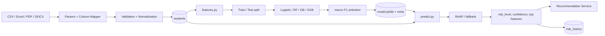

# ML Pipeline

## 1. Goal

Predict each student's **risk_level ∈ {low, medium, high}** of dropping out,
along with a calibrated confidence score, and surface the **top contributing
features** behind the prediction.

## 2. Features

Derived in `backend/app/ml/features.py`:

| Feature                | Type       | Source                                                  |
|------------------------|------------|---------------------------------------------------------|
| attendance_pct         | float      | `students.attendance_pct`                               |
| internal_marks         | float      | `students.internal_marks`                               |
| semester_marks         | float      | `students.semester_marks`                               |
| backlogs               | int        | `students.backlogs`                                     |
| fee_delay_days         | int        | `students.fee_delay_days`                               |
| fee_paid               | int (0/1)  | `students.fee_paid`                                     |
| age                    | int        | `students.age`                                          |
| semester               | int        | `students.semester`                                     |
| financial_status_ord   | int        | `low=0, medium=1, high=2` (inverted: high income → 2)   |
| placement_readiness_ord| int        | `low=0, medium=1, high=2`                               |
| engagement_score       | float      | f(attendance_pct, len(extracurricular), behavioral)     |

`engagement_score = 0.6 * (attendance_pct/100) + 0.3 * min(len(extracurricular)/100, 1) + 0.1 * (1 if behavioral_indicators clean else 0)`

## 3. Synthetic Label

```
high   if attendance_pct < 60 OR backlogs >= 3 OR internal_marks < 40
medium if (attendance_pct < 75) OR (backlogs >= 1) OR
          (internal_marks < 55) OR (fee_delay_days > 30)
low    otherwise
```

10 % label noise is added so the models actually have to *learn* — and so
metrics aren't artificially perfect.

## 4. Models

Trained in `backend/app/ml/train.py` and the standalone CLI
`ml/training_scripts/train_baseline.py`:

* `LogisticRegression` (with `StandardScaler`)
* `RandomForestClassifier` (n_estimators=200, max_depth=12)
* `GradientBoostingClassifier` (n_estimators=200, max_depth=4)
* `XGBClassifier` — only if `xgboost` imports cleanly.

The winner is chosen by **macro-F1 on a 20 % held-out split**, then persisted
to `ml/artifacts/model.joblib` together with `model_meta.json` containing:

```json
{
  "model_name": "RandomForestClassifier",
  "trained_at": "2025-...",
  "feature_list": ["attendance_pct", "..."],
  "metrics": {"accuracy": 0.91, "macro_f1": 0.89, "per_class_f1": {...}},
  "confusion_matrix": [[..]],
  "feature_importances": [{"feature": "attendance_pct", "importance": 0.42}, ...],
  "class_labels": ["low", "medium", "high"]
}
```

## 5. Inference

`PredictionService` (in `backend/app/services/prediction_service.py`):

1. Lazy-loads `model.joblib` once per process; if missing, **auto-trains**
   from `datasets/synthetic_students.csv` (or `sample_students.csv`).
2. Builds the feature row from the `Student` ORM object.
3. Runs `predict_proba`, picks the argmax class, captures the probability as
   `confidence`.
4. Persists a `predictions` row + appends to `risk_history`.

## 6. Explainability

`ExplainabilityService`:

* Tries `shap.TreeExplainer` for tree-based models. Returns top-K feature
  contributions with sign + magnitude per sample.
* Falls back to `permutation_importance` + a per-sample contribution heuristic
  (`(value - feature_mean) * feature_importance`) when SHAP is unavailable.
* Returns a human-readable sentence such as:

  > *"This student is high risk primarily because attendance (52 %) is far
  > below the cohort average and there are 4 active backlogs."*

## 7. Pipeline Diagram


